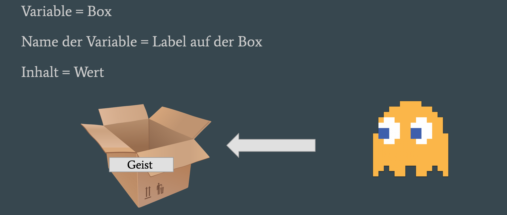

Variablen
=====================================

Variablen sind ein wichtiges Konzept in der Informatik, du kannst sie dir vorstellen wie eine Box mit beliebigen Inhalt.  
Diese  Box hat einen Namen mit dem man sie finden kann und einen Inhalt den du verändern kannst.
  
Auch Pac-Man benutzt Variablen! In der Datei `./tutorial/Variablen.js` haben wir ein paar Variablen vorbereitet die im Spiel genutzt werden. Versuch doch ihren Wert zu veränden und schau was im Spiel passiert!  
Die Folien zu dieser Lektion findest du [hier](https://docs.google.com/presentation/d/1_e9JzTxUT8OMyavScFZm70MOUax7RHZG2mzO0ZcvyD8/edit?usp=sharing).